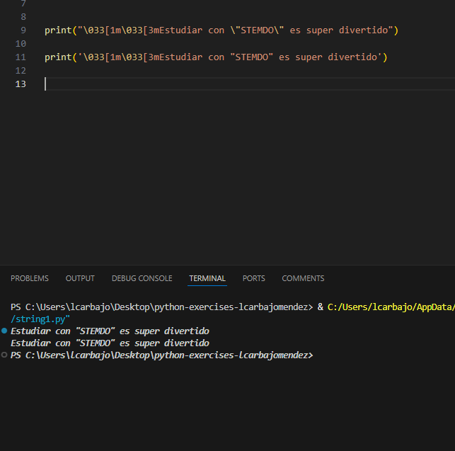
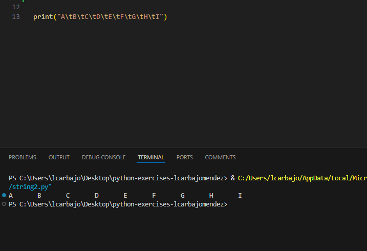
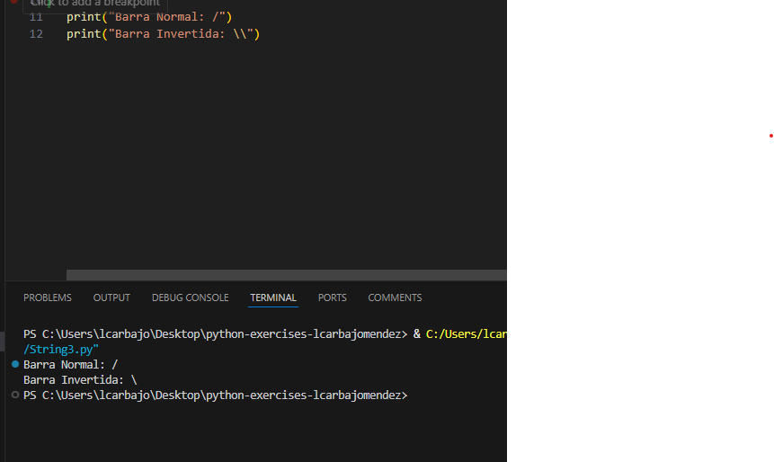
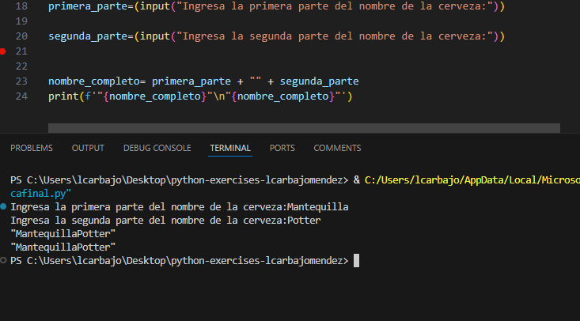

## Solución del modulo 1

En este documento se va a desarrollar toda la explicaciones respecto a los ejercicios.

### String 1

En este ejercicio se nos pide pintar una frase con la palabra `STEMDO` entre comillas y en itálica y cursiva. Con esa finalidad y buscando usé `\033[1m\033[3m` para que se pintara en itálica y cursiva.

### String 2

En este ejercicio debemos mostrar una serie de letras con una tabulación. Para lograrlo usé `\t` para la tabulación.

### String 3

El último ejercicio consiste en mostrar la barra normal y la barra invertida. Para lograrlo usé `/` y `\\` respectivamente.

### Práctica Final

El ejercicio final consiste en ingresar dos palabras por teclado, juntarlas y mostrarlas en dos líneas distintas. Para lograrlo usé `input()` para ingresar las palabras y `print()` para mostrarlas. Junté las dos palabras con `variable uno + "" + variable dos` y para mostrarlas en dos líneas distintas usé `\n` entre dos variables ya sumadas como se ve en la imagen. 

