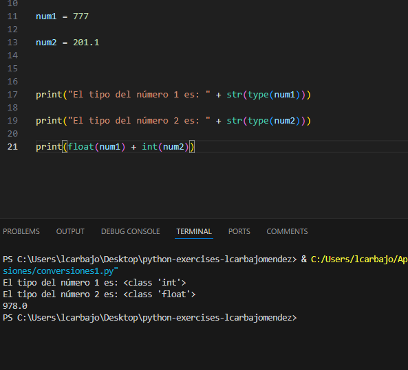
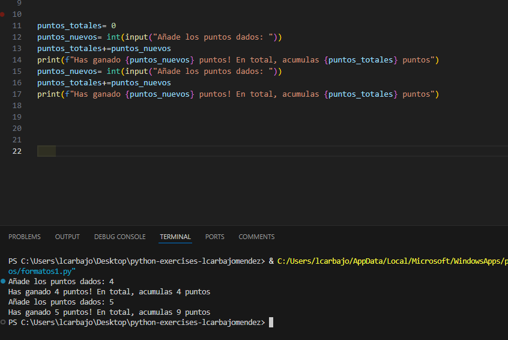
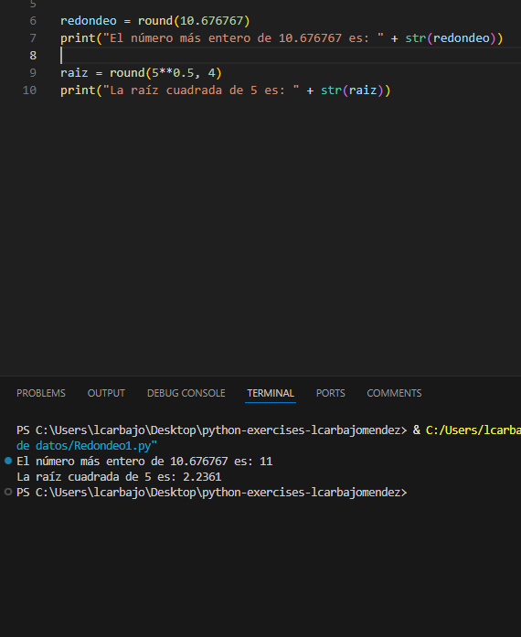
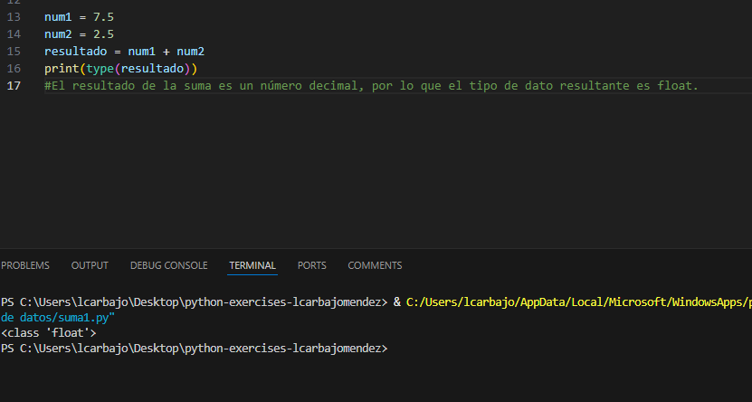
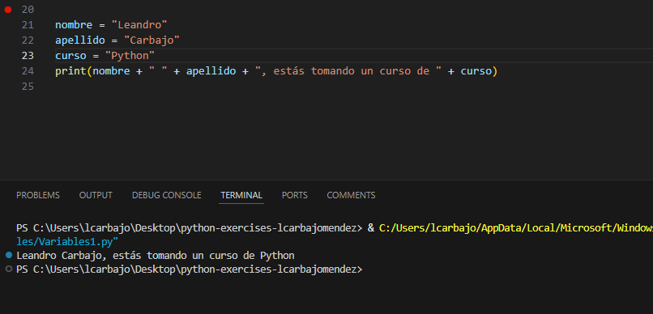

## Solución del modulo 2

En este documento se va a desarrollar toda la explicaciones respecto a los ejercicios.

### Conversiones

En este ejercicio se nos pide realizar conversiones a una serie de números. Primero, creamos dos variables y las mostramos con `str()` y en la sumatoria final realizamos el casteo y sumamos las cantidades. 

### Formatos

Comenzamos con la variable `puntos_totales` que es igual a 0. Luego, pedimos al usuario que introduzca los puntos que ha ganado y los sumamos a la variable `puntos_totales`. Luego, volvemos a pedir al usuario que introduzca los puntos que ha ganado y los sumamos a la variable `puntos_totales`. Finalmente, mostramos el total de puntos que ha ganado el usuario. 

### Tipos de datos

El primer ejercicio es de redondeo. En este ejercicio se nos pide que redondeemos un número a la decena más cercana. Para ello, utilizamos la función `round()` que redondea un número a la decena más cercana. En el segundo apartado, se nos pide que redondeemos un número a cuatro decimales. Para ello, utilizamos la función `round()` con dos argumentos, el número que queremos redondear y el número de decimales que queremos que tenga el resultado. 

El segundo apartado es realizar una sumatoria y saber el tipo de este con `type()`.

### Variables

Creamos tres variables y las mostramos con `print()`. No posee más problemática.

### Práctica Final

El ejercicio final inicia con la petición de un nombre y el monto de ventas del mes. Luego, calculamos la comisión con la fórmula `ventas * 0.13` y finalmente mostramos el resultado con `print()`. El `:.2f` es para mostrar dos decimales. 

