## Solución del modulo 3

En este documento se va a desarrollar toda la explicaciones respecto a los ejercicios.

### Booleanos

En el primer ejercicio, se calcula la raíz cuadrada de 25 y se compara con la división de 65 entre 13. El resultado es True, ya que la raíz cuadrada de 25 es igual a 5 y 65 dividido entre 13 es igual a 5.

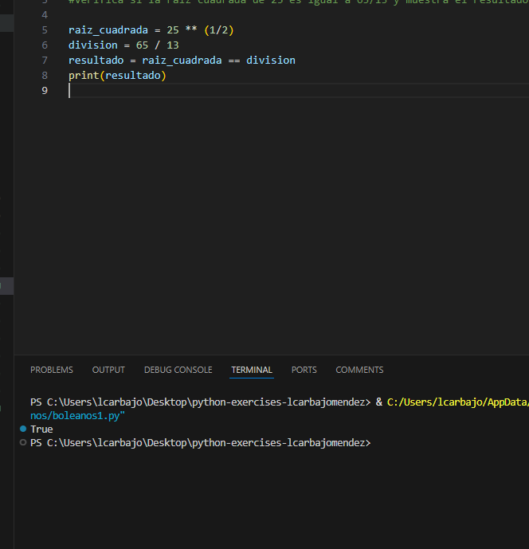

### Diccionarios

Respecto al ejercicio sobre el diccionario, se crea un diccionario con los datos de Karen, se imprime el apellido de Karen, se reasignan los valores de las claves `edad` y `ocupacion` con los nuevos datos y se agrega la nueva clave `pais` con el valor `Colombia`.

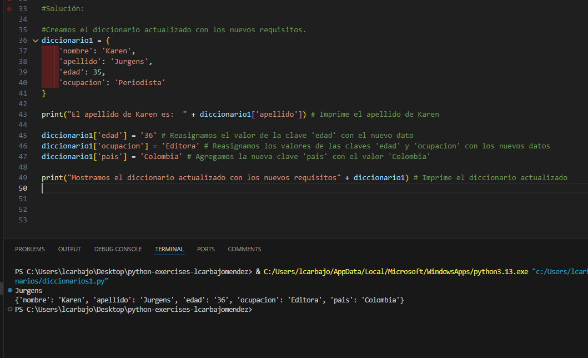

### Listas

Creamos una lista con 5 elementos, luego agregamos un nuevo elemento a la lista usando el método `append()`, luego eliminamos el tercer elemento usando el método `pop()` de la lista, lo almacenamos en una variable y finalmente imprimimos la lista actualizada y el elemento eliminado.

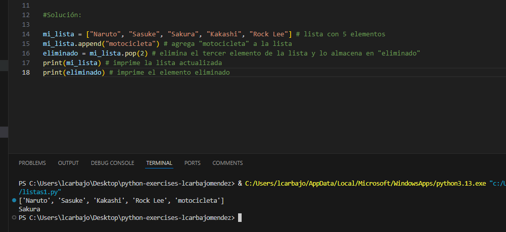

### Metodos

En el primer apartado creamos la variable `palabra` con el valor `"orde*N*ador"`, luego creamos la variable `letra` con el valor de la letra en la posición 4 de la palabra y finalmente imprimimos el valor de la variable `letra`.

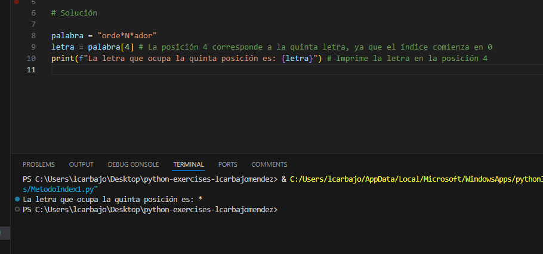

En el segundo apartado apartado creamos la variable `frase` con un texto y luego imprimimos el índice de la primera y última aparición de la palabra `práctica` en la frase usando `index()` y `rindex()` respectivamente.

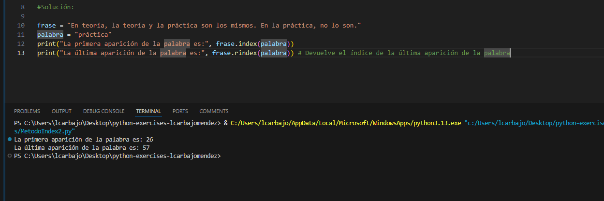

En el tercer apartado creamos la lista `lista_palabras` con 14 elementos, luego unimos los elementos de la lista en un solo string usando `join()` y lo convertimos a mayúsculas con `upper()`, imprimimos el resultado y finalmente reemplazamos las palabras `difícil` y `mala` con `FÁCIL` y `BUENA` respectivamente y lo almacenamos en la variable `linea_modificada`.

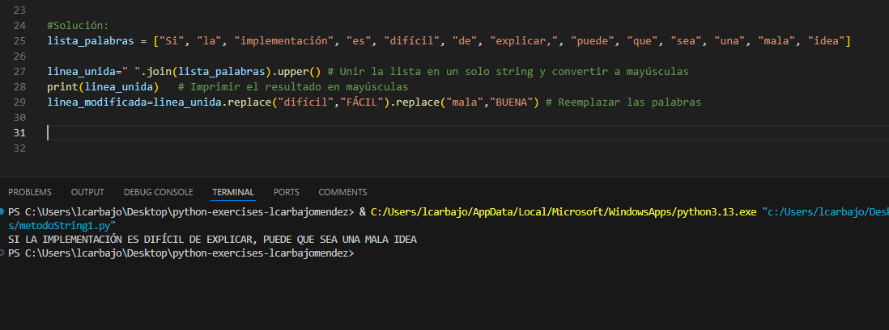

### Propiedades 

En el ejercicio de propiedades, se crea una variable `repeticion` con el valor de la concatenación de la palabra `""` multiplicados por 15 y se imprime el valor de la variable.

En el segundo apartado creamos la variable `poema` con el texto del poema y luego imprimimos el resultado de verificar si la palabra `agua` no está en el poema usando `not in`.

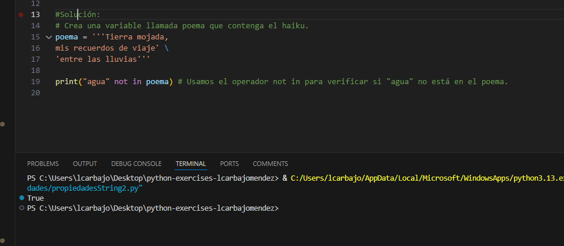

El tercer apartado crea la variable `palabra` con el valor `"electroencefalografista"` y luego imprime la longitud de la palabra a través de la propiedad `len()`.

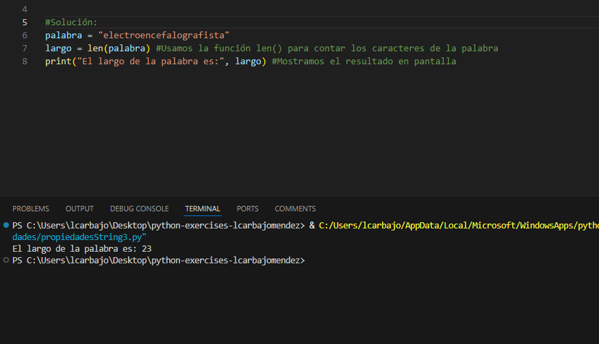

### Tuplas 

En el primer ejercicio de tuplas, se crea una tupla `mi_tupla` con 18 elementos y luego se imprime el número de veces que aparece el valor 2 en la tupla con la función `count()`.

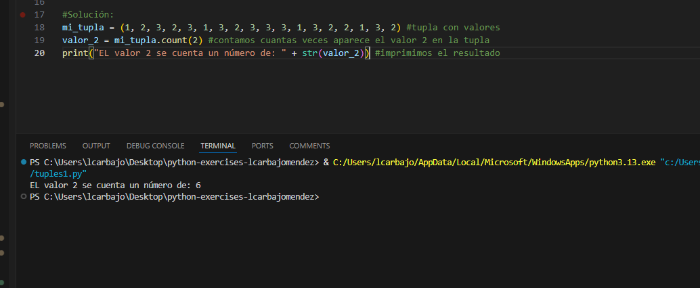

En el segundo ejercicio de tuplas, se crea una tupla `mi_tupla` con 8 elementos, se convierte en lista con `list()` y se imprime el valor de la lista.

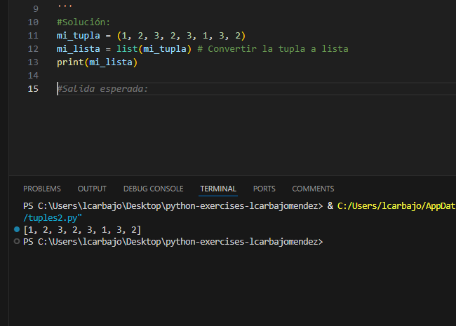

Creamos una tupla `mi_tupla` con 4 elementos y luego accedemos a los elementos de la tupla mediante sus índices y los almacenamos en las variables `a`, `b`, `c` y `d`. Finalmente, imprimimos los valores de las variables.

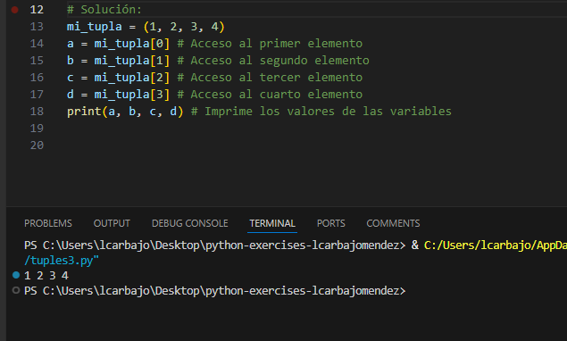

### Variado

El primer apartado del variado crea dos conjuntos `set1` y `set2` y luego imprime el resultado de unir los dos conjuntos usando el método `union()`. Luego, agrega el elemento `"Damián"` al conjunto usando el método `add()` y finalmente elimina un elemento al azar del conjunto usando el método `pop()` y lo imprime.

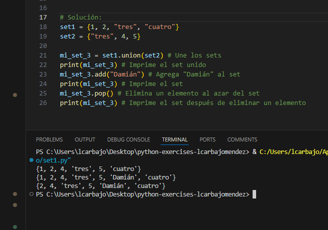

En el segundo, creamos una varible con un texto y luego imprimimos la primera palabra de la frase cuya longitud es de 9 caracteres. Necesitaremos usar `[0:9]` para extraer la primera palabra.

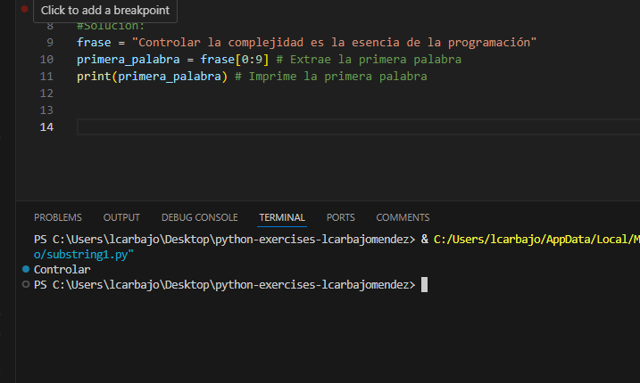

Igual que el anterior, pero esta vez tomamos cada tercer caracter desde el noveno hasta el final de la frase usando `[8::3]` y lo almacenamos en la variable `caracteres` y lo imprimimos.

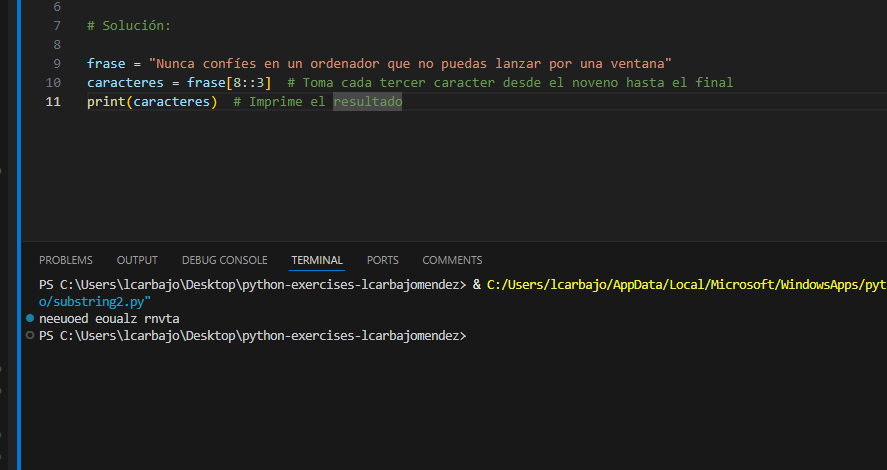

Por último, creamos una variable `frase` con un texto y luego invertimos la frase usando el método `[::-1]` y la almacenamos en la variable `frase_invertida`y la imprimimos.

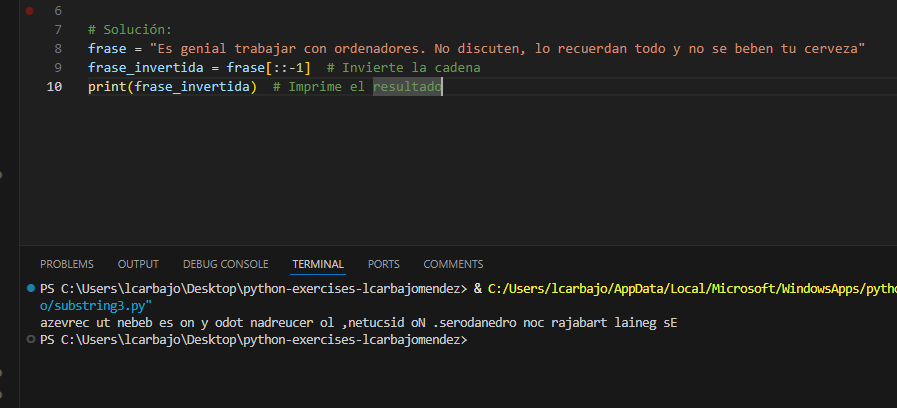

### Práctica Final

Para actividad final solicitamos un texto y tres letras transformándolo en minúsculas con `lower()`, luego contamos cuántas veces aparece cada letra en el texto con `count()`, mostramos el resultado de cada letra. Tras ello, contamos el total de palabras en el texto usando `len()` y `split()`, mostrando el resultado. Luego, obtenemos la primera y última letra del texto y mostramos el resultado. Invertimos el orden de las palabras del texto y mostramos el resultado con `split()` y `join()`. Finalmente, verificamos si la palabra "Python" está presente en el texto y mostramos el resultado.

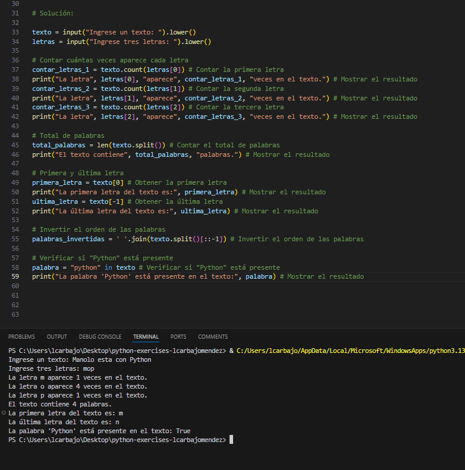