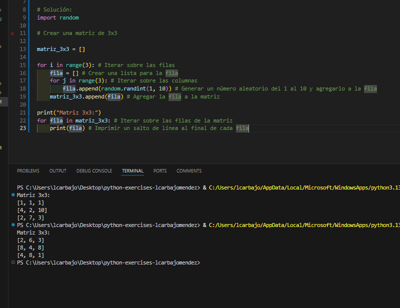
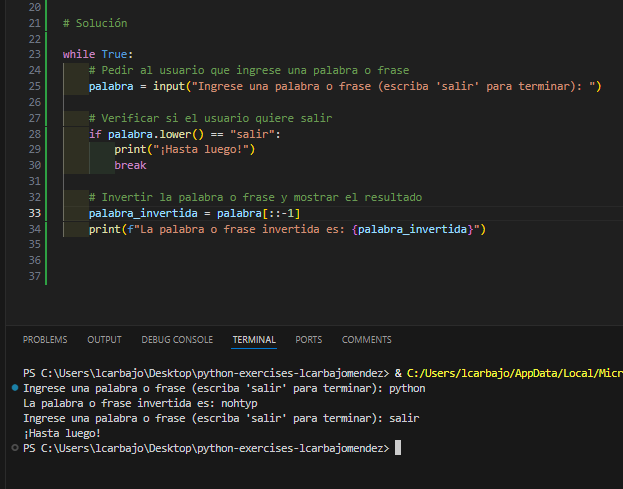
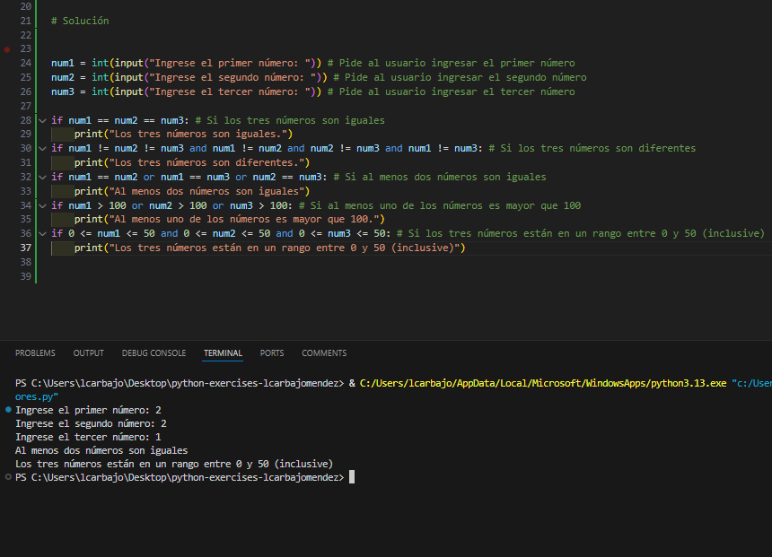
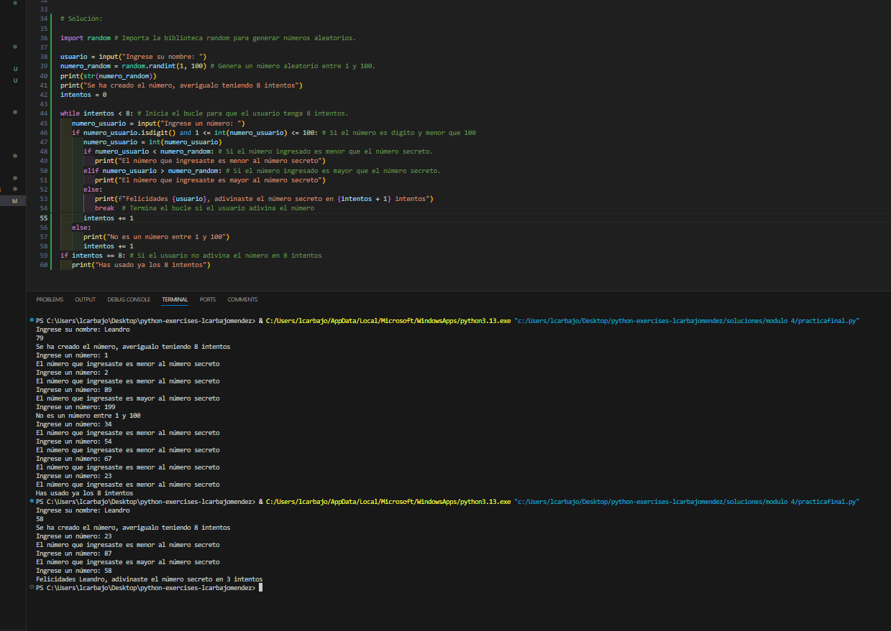

## Solución del modulo 4

En este documento se va a desarrollar toda la explicaciones respecto a los ejercicios.

### Bucle For

En el bucle for importamos la librería random para generar números aleatorios. Luego creamos una matriz vacía llamada `matriz_3x3`. El primer bucle `for` se utiliza para iterar sobre las filas de la matriz, y el segundo bucle `for` se utiliza para iterar sobre las columnas de cada fila. Dentro del segundo bucle, generamos un número aleatorio entre 1 y 10 utilizando `random.randint(1, 10)` y lo agregamos a la fila. Finalmente, agregamos la fila a la matriz. Al final, imprimimos la matriz con un salto de línea al final de cada fila. 

### Bucle While

En este código, creamos un bucle while que se ejecuta indefinidamente. Dentro de este bucle, pedimos al usuario que ingrese una palabra o frase. Si el usuario ingresa "salir", el bucle se rompe y se imprime un mensaje de despedida . Si el usuario ingresa cualquier otra cosa, invertimos la palabra o frase utilizando `[::-1]` y la mostramos. 

### Comparadores y operadores lógicos 

En el apartado de operadores lógicos, creamos tres variables `num1`, `num2` y `num3` y pedimos al usuario que ingrese tres números. Luego, utilizamos diferentes comparadores y operadores lógicos para evaluar diferentes condiciones y mostrar mensajes según sea necesario. Los operadores lógicos utilizados son `==` (igual a), `!=` (diferente a), `or` (o), `and` (y), `>` (mayor que), `<` (menor que) y `<=` (menor o igual que). En algunos apartados referentes a rangos también se puede usar el operador `in range` para evaluar si un número está dentro de un rango específico descubierto a raíz de verlo con la compañera Raquel. 

### Práctica final 

Referente al final de la práctica, se nos pide que creamos un programa que pida al usuario su nombre y luego se genere un número aleatorio entre 1 y 100. El usuario tendrá 8 intentos para adivinar el número secreto. Si el usuario ingresa un número que no es entre 1 y 100, se le pedirá que ingrese un número válido. Si el usuario ingresa un número menor que el número secreto, se le mostrará un mensaje indicando que el número ingresado es menor que el número secreto. Si el usuario ingresa un número mayor que el número secreto, se le mostrará un mensaje indicando que el número ingresado es mayor que el número secreto. Si el usuario ingresa el número secreto, se le mostrará un mensaje felicitándolo por adivinar el número secreto en el número de intentos que haya utilizado. Si el usuario no adivina el número en 8 intentos, se le mostrará un mensaje indicando que ha usado ya los 8 intentos. En el script he dejado que se muestre el número secreto para probar el programa.

