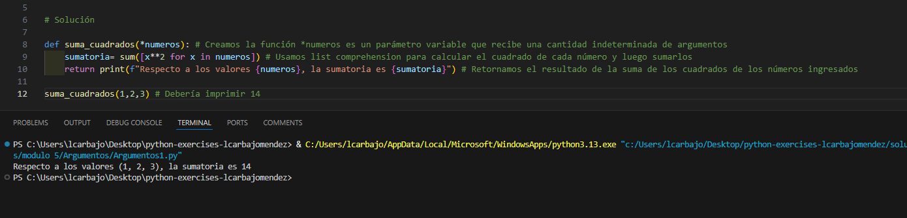
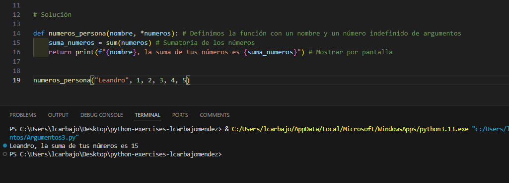
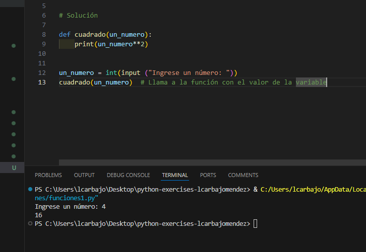

## Solución del modulo 5

En este documento se va a desarrollar toda la explicaciones respecto a los ejercicios.

### Argumentos

El primer método en el que usaremos argumentos será el método `suma_cuadrados`, el cual recibe una cantidad indeterminada de argumentos y los convierte en una lista (`list comprehension`), luego calcula el cuadrado de cada número y los suman. Finalmente imprime el resultado de la suma de los cuadrados de los números ingresados.

El segundo método en el que usaremos argumentos será el método `suma_absolutos`, el cual recibe una cantidad indeterminada de argumentos y los convierte en una lista (`list comprehension`) transformando estos en valores absolutos con `abs()`, luego se realiza la sumatoria con la función `sum()` y finalmente imprime el resultado de la suma de los absolutos.

El último caso es el método `numeros_persona`, el cual recibe un nombre y un número indefinido de argumentos, los suma y muestra el resultado por pantalla. 

### Funciones

La función cuadrado recibe un número y lo imprime elevado a la potencia de 2. Creamos una variable por teclado y la pasamos a la función para que imprima el cuadrado del número ingresado.

