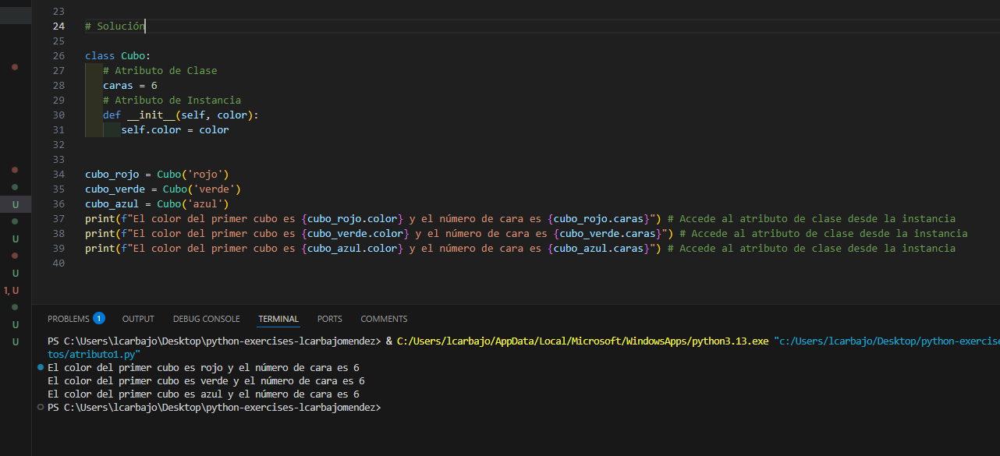
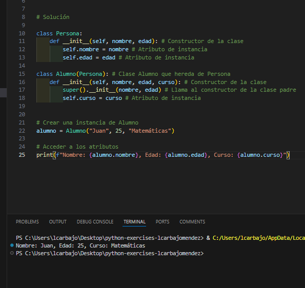
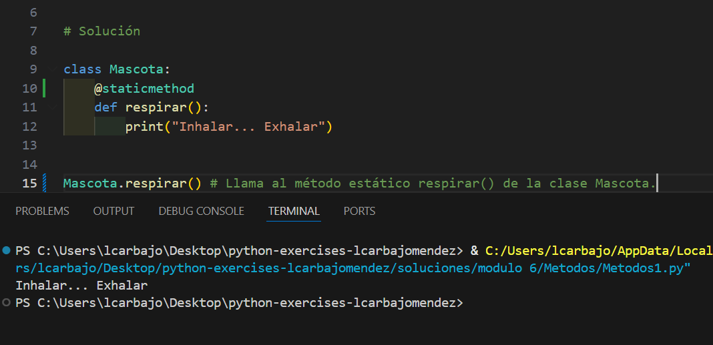
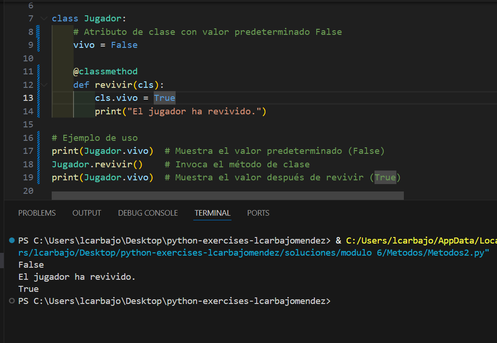
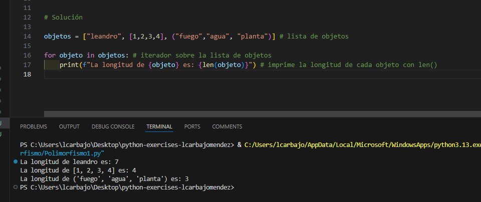
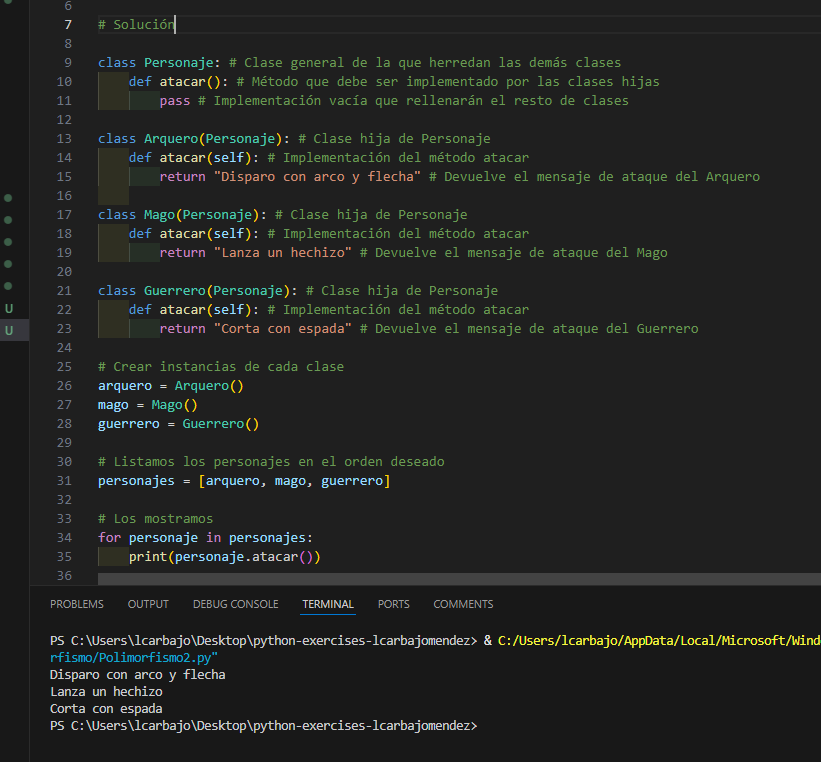

## Solución del modulo 6

En este documento se va a desarrollar toda la explicaciones respecto a los ejercicios.

### Atributos

Respecto a los atributos de clase y de instancia, se puede ver que el atributo de clase es el mismo para todos siendo las caras de la clase Cubo, mientras que el atributo de instancia es diferente para cada objeto de la clase Cubo siendo el color de cada objeto diferente que creemos. Concretando, hemos cambiado el color en tres ocasiones para cada objeto de la clase Cubo en rojo, verde y azul.

### Herencia

Sobre herencia, se puede ver que la clase Alumno hereda de la clase Persona, y por tanto, tiene acceso a los atributos de la clase Persona. Además, la clase Alumno tiene un atributo adicional llamado `curso` que no existe en la clase Persona. Tras crear una instancia de la clase Alumno, se puede ver que se puede acceder a los atributos de la clase Persona y a los atributos de la clase Alumno. 

### Métodos

La clase `Mascota` tiene un método estático llamado `respirar()`. Este método no pertenece a ninguna instancia de la clase, sino que es una función que se puede llamar directamente desde la clase. En el código se puede ver que se llama directamente desde la clase `Mascota` al método `respirar()`.

Creamos la clase `Jugador` con un atributo de clase llamado `vivo` con valor predeterminado `False`. Luego, creamos un método de clase llamado `revivir()` que cambia el valor de `vivo` a `True` y muestra un mensaje de confirmación . Finalmente, llamamos al método `revivir()` y mostramos el valor de `vivo` después de invocar el método. 

### Polimosfirmo

Sobre el polimorfismo, se puede ver que se ha creado una lista de objetos de diferentes tipos (cadena, lista y tupla) y se ha utilizado un bucle `for` para iterar sobre la lista. En cada iteración, se imprime la longitud del objeto actual utilizando el método `len()`, que es un método polimórfico que funciona de manera diferente dependiendo del tipo de objeto. Por ejemplo, para una cadena, `len()` devuelve la cantidad de caracteres, mientras que para una lista o tupla, devuelve la cantidad de elementos.

El segundo supuesto de polimorfismo es la clase `Personaje` con un método `atacar()` que debe ser implementado por las clases hijas `Arquero`, `Mago` y `Guerrero`. Cada clase hija implementa el método `atacar()` de manera diferente, devolviendo un mensaje de ataque específico para cada tipo de personaje. Luego, se crean instancias de cada clase y se almacenan en una lista. Finalmente, se utiliza un bucle `for` para iterar sobre la lista y llamar al método `atacar()` para cada personaje, mostrando el mensaje de ataque correspondiente. 

